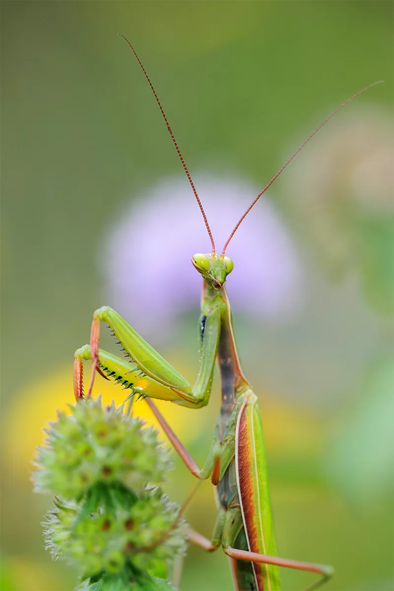

# PracticaEOBM_Escritura

## Descripción
Este es un ejercicio para aprender Markdown
###### Este es un subtítulo de sexto nivel


Libertad Pantoja Hernández
=============

## Descripción personal
Estudié la Licenciatura en Ciencias Genómicas y el Doctorado en Ciencias Biomédicas en la UNAM y actualmente me dedico a escritura técnica y científica.

Conozco los siguientes lenguajes de programación:
* Python
* R
* HTML

Este es mi blog
[Blog](https://libertadph.wordpress.com/)


Escribe la variable `x` en el apartado `m` 

```python
a = 5
```


 $`\sqrt{3x-1}+(1+x)^2`$
